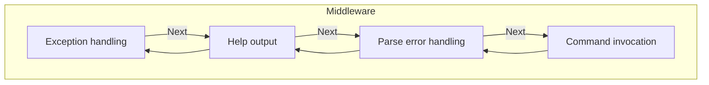

# Invocation

When you invoke a command, the CLI arguments are parsed into a parse result.
An invocation context is created that holds all the imporant information that 
might be needed: The parse result, diagnostics, unmatched tokens, etc. etc.

Once we have an invocation context, we use this to run the invocation chain,
a.k.a the "Middleware". The invocation chain is a series of delegates that act
upon the invocation context, [just like in ASP.NET][1]. 

Each delegate in the middleware can do the following things.

* Decide if the next delegate should be called
* Perform some operation before or after calling the next delegate in the chain.

[1]: https://learn.microsoft.com/en-us/aspnet/core/fundamentals/middleware/?view=aspnetcore-9.0