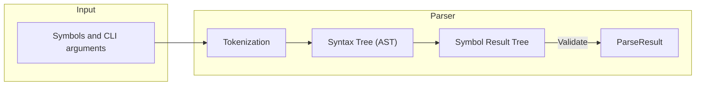

# Parsing

## 1. Tokenization

We start by taking the command line arguments and tokenize it
into distinct tokens.  
The tokenizer is also responsible for option unbundling (turning `-abc` into `-a -b -c`),  
and argument splitting (turning `--foo=bar` into `--foo bar`).

:::info
See `src/Parsing/Tokenizer.cs` for implementation
:::

## 2. Syntax Tree (AST)

Now when each input argument is represented with a token, which includes a type, lexeme, and
text span (positon and length) of the token, we can start to make sense of it by looking at the 
provided symbols (commands, options, arguments).

From the tokens we create a syntax tree, which is a tree representation of the tokens and their
corresponding symbols. All unmatched tokens are discarded from the tree itself, and stored in a 
separate list for later use.

All nodes in the syntax tree represents a specific token from the input.

:::info
See `src/Parsing/Parser.cs` for implementation
:::

## 3. Symbol Result Tree

We now have all the information we need to put together the symbol result tree.  

The symbol result tree resembles the syntax tree but only contains nodes that represents a symbol.
A symbol does not necessarily need to have a corresponding token (i.e. a root command).

The symbol result tree will also contain any validation errors associated with input for a specific symbol.

:::info
See `src/Parsing/ParseResultBuilder.cs` for implementation
:::

## 4. Parse Result

The parse results aggregate together all the information we know about the parse operation:

* The symbol tree
* Diagnostics
* Tokens
* Unmatched tokens
* Lookup table for symbols to their results

:::info
See `src/Parsing/ParseResult.cs` for implementation
:::